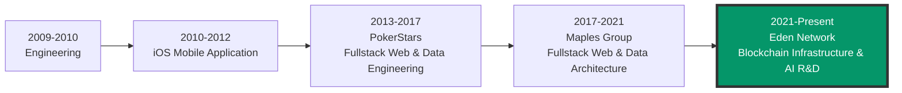

<div align="center">
  
  [](https://www.linkedin.com/in/jonathanevans87)
  [](https://github.com/yoniebans)
  [](mailto:jonny@techashai.com)
  
</div>

## 🚀 About Me

Pragmatic full-stack software engineer with 15+ years delivering high-quality production systems across enterprise finance, blockchain protocols, and AI applications. Currently building blockchain infrastructure and doing AI research and development at [Eden Network](https://www.edennetwork.io/)

```typescript
const yoniebans = {
  location: "Rome, Italy 🇮🇹",
  languages: ["English", "Italian", "Spanish"],
  currentRole: "Software Engineer @ Eden Network",
  focus: [
    "Blockchain Infrastructure",
    "Smart Contracts",
    "Full-Stack Development",
    "AI/ML",
  ],
  philosophy: "Quality-first engineering with TDD and clean code practices",
};
```

## 💼 Professional Highlights

### 🏗️ Current Work

- **Eden Network** - Building MEV infrastructure and blockchain data systems
- **Open Source** - Contributing to global blockchain transparency and compliance

### 📊 Scale & Impact

- 🎰 **17.5 billion** poker hands/year at PokerStars
- ⛓️ **Millions** of daily blockchain transactions at Eden
- 🌍 **100+** distributed VMs orchestrated for data collection
- 🚀 **First** to publish Avalanche data on BigQuery

## 🛠️ Tech Stack

### Languages


### Blockchain & Web3


### Frontend


### Backend & Data


### DevOps & Tools


## 🔥 Featured Projects

### 🌐 Open Source Contributions

#### [MEV-Boost ETL](https://github.com/eden-network/mev-boost-etl)

Comprehensive data collection system for Ethereum ecosystem

- 📊 Processing ALL relay data globally
- 🔧 Custom Python ETL with distributed infrastructure
- 🚀 100+ VMs orchestrated with Terraform + Kubernetes
- 📈 React frontend for MEV bidding visualization

#### [OFAC Compliance Solution](https://github.com/0xprotect/sanctions-list-service)

Blockchain compliance system preventing sanctioned address inclusion

- 🛡️ On-chain blacklist maintenance on Ethereum
- 🔄 Automatic OFAC list synchronization
- ⚡ Real-time transaction filtering for block builders

### 💡 Personal Projects

#### [Cryptax](https://github.com/yoniebans/cryptax)

Full-stack cryptocurrency tax compliance tool for Italian regulations (WIP)

- ⛓️ Multi-chain support (ETH, AVAX, SOL, ARB, BASE)
- 📊 DuckDB analytics with efficient batch processing
- 🔐 Exchange API integration with secure authentication

#### [Artifect](https://github.com/yoniebans/artifect)

AI-powered software engineering platformc (WIP)

- 🤖 Multi-provider AI integration (Anthropic, OpenAI)
- 🏗️ Modern monorepo with Next.js + NestJS
- 👥 Real-time collaboration with SSE

#### [NOUS Research - Poker RL Environment](https://github.com/NousResearch/atropos/pull/84)

Open-source contribution to Atropos RL framework

- 🃏 Six-seat No-Limit Hold'em environment
- 🧠 Novel reward system for LLM training
- 📊 [PostgreSQL pipeline processing thousands of hands](https://github.com/yoniebans/poker-rl-data)
- 🏆 Code merged into global AI research framework

## 🎯 Current Focus

- 🔗 Building DeFi protocols and blockchain infrastructure
- 🤖 Exploring AI/blockchain intersections
- 📚 Contributing to open-source blockchain tools
- 🌍 Creating public good data infrastructure

## 💼 Career Journey



## 🏆 Key Achievements

- 🥇 **First** to publish Avalanche blockchain data on BigQuery
- 🌍 **Open Source Impact**: MEV-Boost ETL used by global research community
- 🚀 **Scale**: From millions to billions of transactions across career
- 🏗️ **Leadership**: Built and led data engineering team at Eden Network
- 💡 **Innovation**: Multiple first-to-market blockchain solutions

## 📬 Let's Connect!

I'm passionate about building high-quality software that scales: blockchain protocols, AI applications, full-stack systems and all things data.

Currently interested in:

- 🏦 DeFi infrastructure
- 🤖 AI/ML applications in blockchain
- 🌐 Open-source contributions

<div align="center">
  
  **[📧 Email](mailto:jonny@techashai.com) • [💼 LinkedIn](https://www.linkedin.com/in/jonathanevans87) • [🐦 Twitter](https://twitter.com/yoniebans)**
  
</div>
